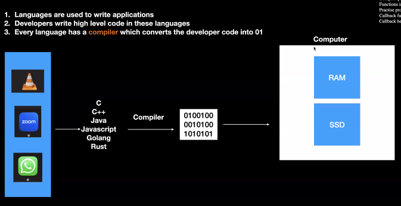
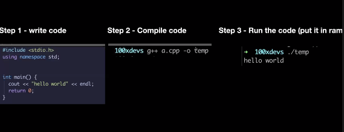
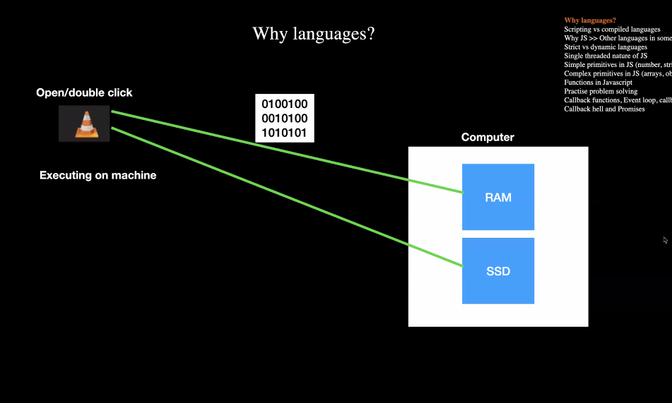
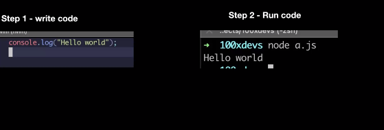

## Details
- Date: 3/12/2023
- Week: 1
- Topic: Javascript Overview

## Topics
- `1.0` Why Languages? 
- `1.1` Interpreted vs Compiled Languages
- 1.2 Why Js >> Other languages
- 1.3 Strict vs Dynamic Languages
- 1.4 Single threaded nature of JS

# 1.0 | Why Languages?

Computers are dumb. They can only understand 1's and 0's. So how do we get from 1's and 0's to the web pages we see today? We use languages. `Languages` are a way for us to communicate with computers. They are a way for us to tell computers what to do.

### 1.0.1 | `Programming languages`: 
Converting developer's instructions into a language that computers can understand.

### 1.0.2 | `Compilers`:
Compilers are programs that convert code written in a high-level language into a lower level language.

# 1.1 | Interpreted vs Compiled Languages
Interpreted languages are languages that are not compiled. They are executed line by line. Compiled languages are languages that are compiled. They are converted into a lower level language before execution.

- Line by line execution conversion takes place in `Interpreted languages`.