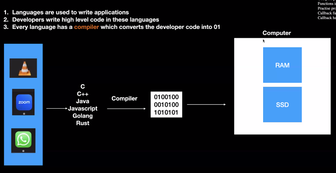
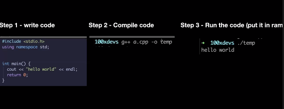
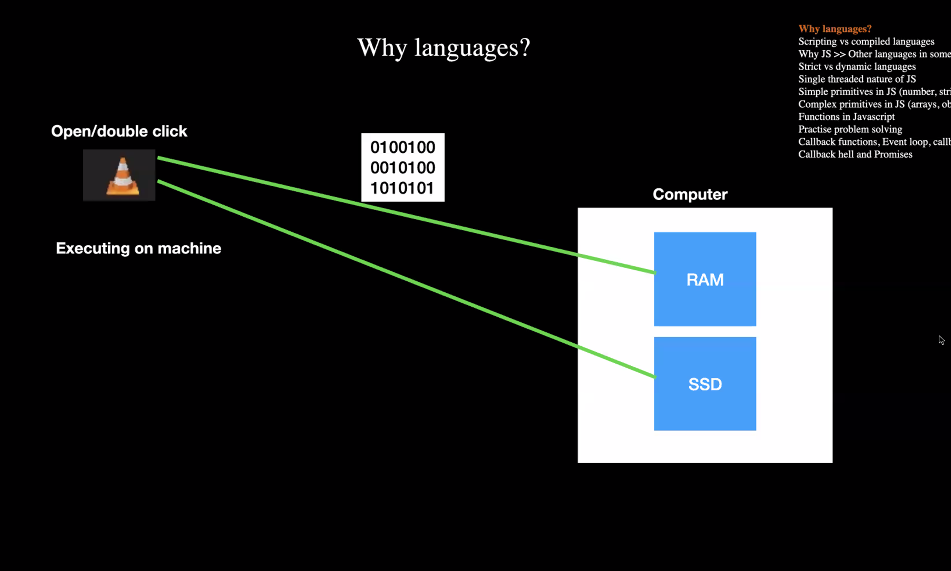
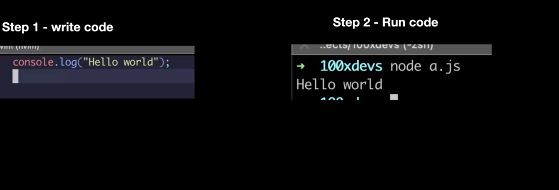
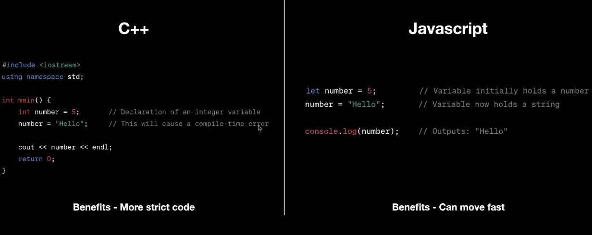
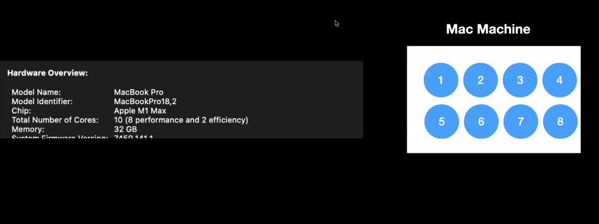
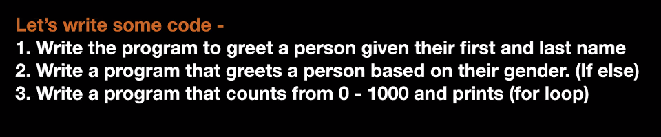

## Details
- Date: 3/12/2023
- Week: 1
- Topic: Javascript Overview

## Topics
- `1.0` Why Languages? 
- `1.1` Interpreted vs Compiled Languages
- 1.2 Why Js >> Other languages
- 1.3 Strict vs Dynamic Languages
- 1.4 Single threaded nature of JS

# 1.0 | Why Languages?

Computers are dumb. They can only understand 1's and 0's. So how do we get from 1's and 0's to the web pages we see today? We use languages. `Languages` are a way for us to communicate with computers. They are a way for us to tell computers what to do.

### 1.0.1 | `Programming languages`: 
Converting developer's instructions into a language that computers can understand.



### 1.0.2 | `Compilers`:
Compilers are programs that convert code written in a high-level language into a lower level language.




# 1.1 | Interpreted vs Compiled Languages
Interpreted languages are languages that are not compiled. They are executed line by line. Compiled languages are languages that are compiled. They are converted into a lower level language before execution.



- Line by line execution conversion takes place in `Interpreted languages`.

### 1.1.1 | `Interpreted languages` | Js Hands on :

- Harkirat makes us code a Js file and run it in the terminal.
- Discussed `partial execution` of Js file (When it has errors).
    ```
    [JavaScript]

    console.log("Hello World");
    console.log(a);
    ```
- [Hands On JS File](hands_on.js)


# 1.2 | Why Js >> Other languages
- Js is the only language that can run on the browser.
- Js has been standardized by ECMA (European Computer Manufacturers Association), hence we are stuck with it.
- Js doesent have strict types, hence it is easy to learn.

# 1.3 | Strict vs Dynamic Languages
- `IMP`: Runtime Error: Refers to errors that occur while a program is running. These errors are usually caused by something the programmer did wrong, such as forgetting to initialize an object before accessing it, Or when you are arbitrairily changing the type of a variable.
[Motivation for `Typescript`](https://www.typescriptlang.org/docs/handbook/typescript-in-5-minutes.html)


# 1.4 | Single threaded nature of JS
The number of threads in a program determines the number of tasks that can be executed at the same time. A single-threaded program can only execute one task at a time. A multi-threaded program can execute multiple tasks at the same time.


- too See: [Cluster Module](https://nodejs.org/api/cluster.html)

# 1.5 | Simple Primitives in JS


- [Greet](greet.js)
- [Greet_2](greet2.js)
- [Count](count.js)
    ```
    for (let i = 0; i < 1000; ++i){
    console.log(i);
    }
    ```
- [Guess](guess.js)
- 

### 1.5.1 | `Objects`:

```
const person = {
    name: "Harkirat",
    age: 21,
    greet: function(){
        console.log("Hello");
    }
}
```

## 1.6 | `Functions`:

### 1.6.1 | `Function taking a function as an argument`:

Callback: A callback is a function that is to be executed after another function has finished executing — hence the name ‘call back’.

